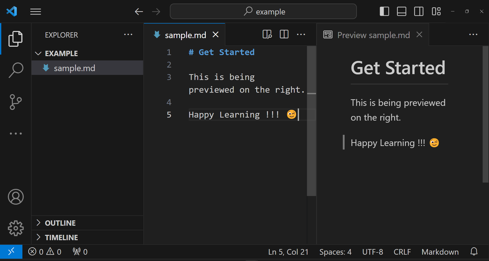

# **Getting Started**

To write a document using Markdown, you can choose from various online Markdown editors. There are several online Markdown editors that provide real-time preview of your document side-by-side as you edit. Some of the popular ones include <a href="https://dillinger.io/" target="_blank">Dillinger</a>, <a href="https://stackedit.io/" target="_blank">StackEdit</a>, etc.

If you want to write a Markdown document locally on you computer, you can use <a href="https://joplinapp.org/" target="_blank">Joplin</a> or <a href="https://code.visualstudio.com/" target="_blank">VS Code</a> to make you work easier. You can also preview you Markdown document easily using these applications.

Below is a screenshot of a Markdown file open in VS Code. On the left you can see the Markdown file and on the right you can see its preview as you edit.

To preview your Markdown document, right click on the file and select `Open Preview` form the drop down menu.

---